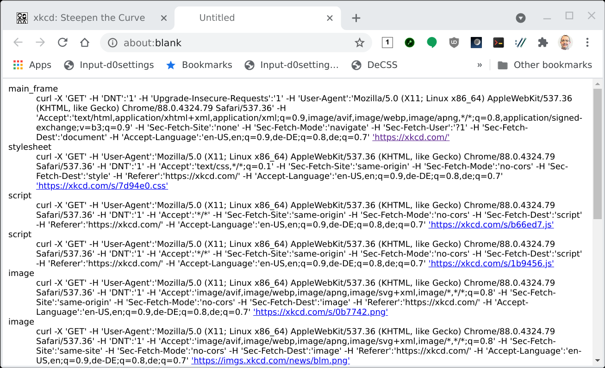

# Chrome URL Logger Extension

This is a Chrome extension that logs all URLs accessed by a tab in form
of [cURL](https://curl.se/) commands to allow easy debugging/repeating
the requests.

# How does it work?

* Install the extension.
* Open a tab that you want to track. Do anything on it to prepare.
* Click the extension icon.
* Interact with the tab. The extension icon badge will count how many
  requests were tracked.
* Click the extension icon again. A new tab will open with all requests
  captured.



# Why the permissions?

Despite by design only tracking a single tab, the `activeTab` permission
turns out to not be sufficient in order to use the `webRequest` API on
a single tab. Thus we request `<all_urls>` as well, and filter in the
extension code for the one tab you are actually monitoring.

Kinda sad.

# Where to download?

Only here. As this extension has quite high permissions (all sites
all content), it will not be officially published on the Chrome Web
Store. Instead, you are expected to verify the source code yourself
before using it to make sure it is not leaking your personal information
anywhere.

So the procedure is first installing `npm` and `node-typescript`, then
executing the following commands:

```sh
$ git clone https://github.com/divVerent/chrome-log-urls
$ cd chrome-log-urls
$ npm install
$ npm run build
```

After that, you can add the source directory as an unpacked extension
to Chrome.

# License

See the included [LICENSE](LICENSE) file.

# Contributing

See the included [CONTRIBUTING.md](CONTRIBURING.md) file.

# Disclaimer

This is not an officially supported Google product.
